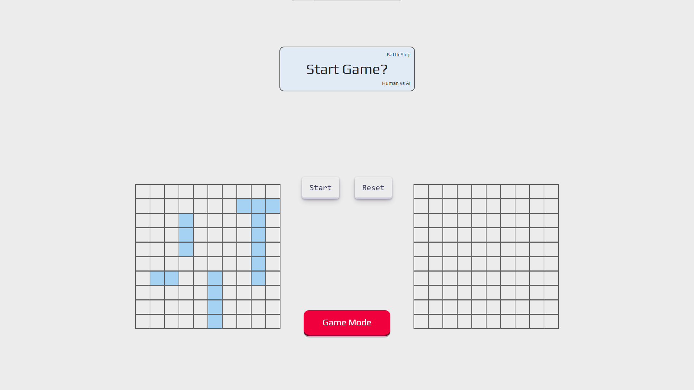
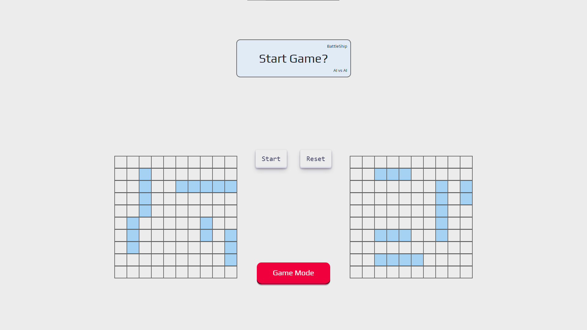
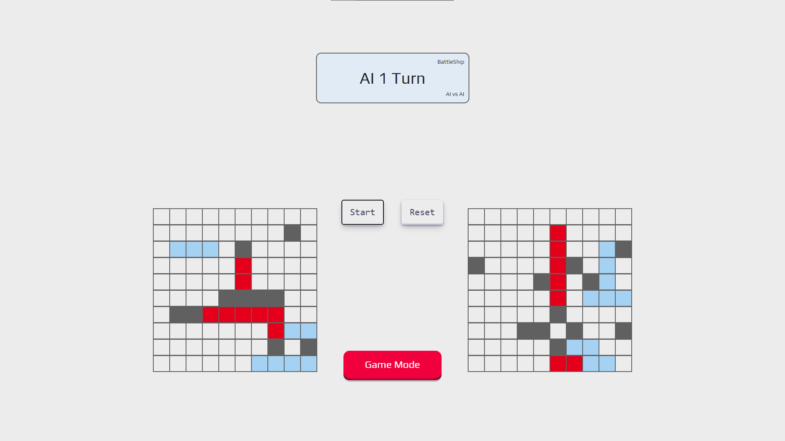

# BattleShip

This project is a web browser version of the boardgame Battleship. This project was built using **Test Driven Development** (TDD).

**Live demo [link](https://rosendo-martinez.github.io/Battleship/)**. 👈

### Technology Used: 
- Jest (JavaScript Testing Framework)
- JavaScript
- CSS
- HTML

### What I gained from this project:
- I gained a deep understanding of why TDD is powerful.
- I gained experience with documenting code.
- I gained experience with OOP.
- I gained experience with using a Git workflow.
- I gained a greater appreciation for pseudocode. 

# Screenshots 

# How to set up project locally

First, clone it.

Then, run `npm install` to install all dependcies.

Finally, run `npm start` to locally host the project.